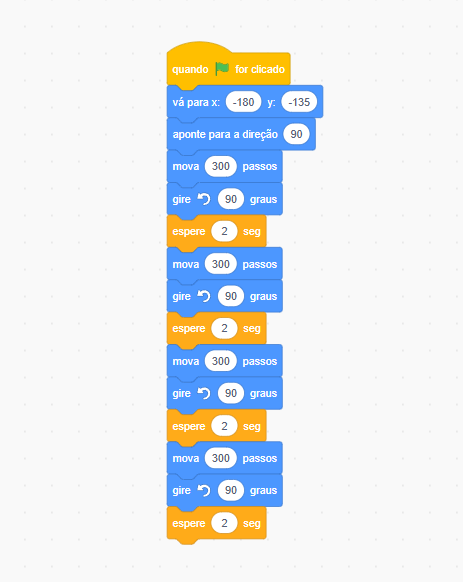
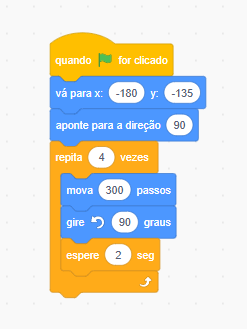
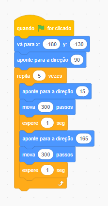

# Exercitando algoritimso com Scratch

Algoritimo para fazer o perssonagem andar para frente, girar a esquerda, andar para frente e girar a esquerda até dar uma volta completa:



Código refatorado com laço de repetição:



Exercicio: Criar em texto um algoritimo que faça o personagem subir e descer na se movendo para a direita 5x cinco vezes, a posição deve seguir o movimento do personagem

```
Personagem: gato
tamanho: 50
posição x: -180
posição y: -130
direcao: 90

repita 5 vezes {

    direcao: 45
    mova 100 passos
    aguarde 2 segundos

    direcao: 135
    direcao: 100 passos
}

direcao: 90
```
No site o algoritimo fica assim:

