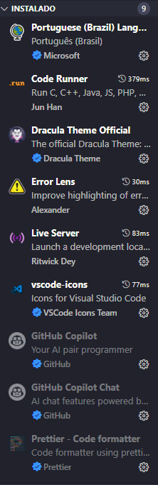
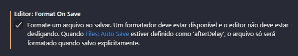

# Plugins necessários no VSCODE



# Configurações

### Ativar Salvamento automático

Arquivo > Salvamento Automático

### Minimapa e rolagem fixa

Ver > Aparência > Minimapa

Ver > Aparência > Rolagem Fixa

### Formatação automática

```ctrl + ,``` - control + virgula e escreva format on save

