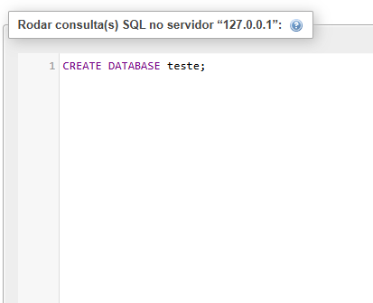
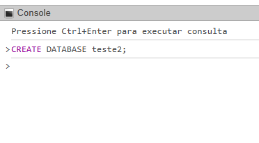
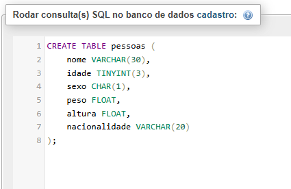
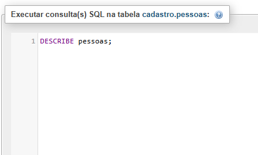
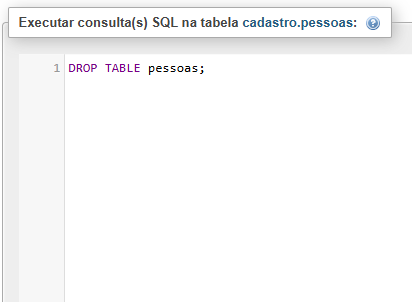
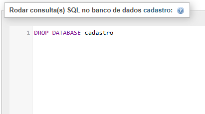
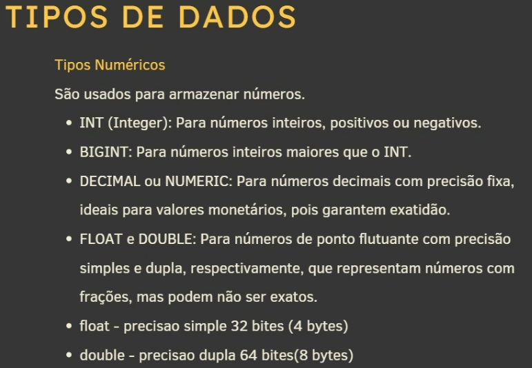
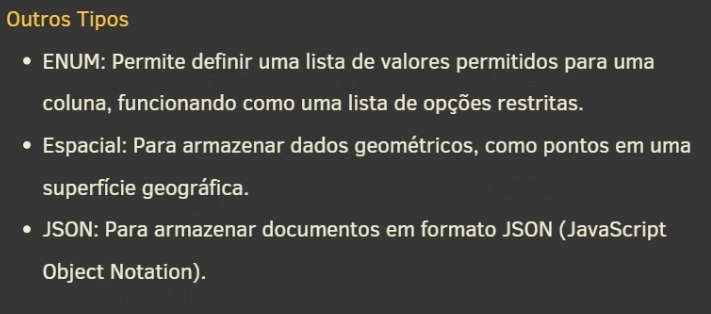

# Aprendendo a trabalhar com banco de dados

## Criando um banco de dados

```sql
CREATE DATABASE teste;
```


## Criando um banco de dados no console

```SQL
CREATE DATABASE teste2;
```


## Criando uma tabela

```sql
CREATE TABLE pessoas (
    id INT NOT NULL AUTO_INCREMENT,
	nome VARCHAR(30) NOT NULL,
    nascimento DATE,
    sexo ENUM('M', 'F'),
    peso DECIMAL(5, 2),
    altura DECIMAL(3, 2),
    nacionalidade VARCHAR(20) DEFAULT 'Brasil',
    PRIMARY KEY(id)
) DEFAULT CHARSET = utf8;

-----------

INSERT INTO pessoas (nome, nascimento, sexo, peso, altura, nascionalidade) VALUES
('Godofredo', '1984-01-02', 'M', 78.5, 1.83, 'Brasil'),
('Maria', '1999-04-11', 'F', 55.2, 1.65, 'Brasil'),
('Marinalva', '1965-04-11', 'F', 77.4, 1.71, 'Alemanha'),
('Endrik', '1995-03-11', 'M', 80.1, 1.77, 'Irlanda'),
('Ana Clara', '2005-04-07', 'F', 57.4, 1.61, 'México');

```


## Usando o comando DESCRIBE
Gera uma descrição da tabela.

```sql
DESCRIBE pessoas;
```




## Usando comando SELECT * FROM tabela

Seleciona tudo da tabela

## Usando o comando DROP TABLE pessoas

Drop apaga a tabela ou banco de dados

```sql
DROP TABLE pessoas
```


## Usando o comando DROP DATABASE para apagar banco de dados

```sql
DROP DATABASE cadastro
```



## Criando banco de dados com default

```sql
CREATE DATABASE bancoConfigurado
DEFAULT CHARACTER SET utf8
DEFAULT COLLATE utf8_general_ci;
```

# Tipos de dados

## Tipos de String (Texto)
Para armazenar dados textuais.


- CHAR: Armazena strings de tamanho fixo.
- VARCHAR: Para strings de tamanho variável, utilizando apenas espaço necessário para o dado
- TEXT: Para textos mais longos de comprimento variável, com um limite maior que o VARCHAR


## Tipos Numéricos
São usados para armazenar números



- INT (Integer): Para números inteiros, positivos ou negativos.
- BIGINT: Para números maiores que o INT.
- DECIMAL ou NUMERIC: Para números decimais com precisão fixa, ideais para valores monetários, pois garantem exatidão.
- FLOAT e DOUBLE: Para números de ponto flutuante com precisão simples e dupla, respectivamente, que representam números com frações, mas podem não ser exatos.
- float - precisão simples 32 bites (4 bytes)
- double - precisão dupla 64 bites (8 bytes)

## Outros tipos de dados



# select from where

```sql
SELECT * FROM `pessoas` WHERE id = 6
```

# alterar colunas

```sql
ALTER TABLE pessoas ADD COLUMN profissao VARCHAR(10);
ALTER TABLE pessoas DROP COLUMN profissao;
ALTER TABLE pessoas add profissao VARCHAR(10) AFTER nome;
ALTER TABLE pessoas ADD COLUMN codigo INT FIRST
```