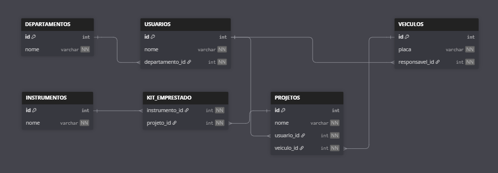

# Criando banco de dados Construtora

- Criando banco de dados:

```sql
CREATE DATABASE CONSTRUTURA
DEFAULT CHARACTER SET utf8
DEFAULT COLLATE utf8_general_ci;
```

- Criando tabela `departamentos`:

```sql
CREATE TABLE `departamentos` (
  `id` int AUTO_INCREMENT PRIMARY KEY,
  `nome` varchar(100) NOT NULL
)

```

- Criando tabela `usuarios`:

```sql
CREATE TABLE usuarios (
    id int AUTO_INCREMENT PRIMARY KEY,
    nome varchar(100) NOT null,
    departamento_id int
    )
```

- Criando tabela `instrumentos`:

```sql
CREATE TABLE instrumentos (
    id int AUTO_INCREMENT PRIMARY KEY,
    nome varchar(100)
)
```

- Criando tabela `kit_emprestado`:

```sql
CREATE TABLE kit_emprestado (
    instrumento_id int,
    projeto_id int
)
```

- Criando tabela `projetos`:

```sql
CREATE TABLE projetos (
    id int primary key auto_increment,
    nome varchar(100),
    usuario_id int,
    veiculo_id int
)
```

- Criando tabela `veiculos`:

```sql
CREATE TABLE veiculos (
    id int primary key auto_increment,
    placa varchar(100),
    responsavel_id int
)
```

- Criando todos os Foreign key usando constrain:

```sql
alter table usuarios
add constraint fk_departamento
foreign key (departamento_id) references departamentos(id);

alter table veiculos
add constraint fk_responsavel
foreign key (responsavel_id) references usuarios(id);

alter table projetos
add constraint fk_usuario
foreign key (usuario_id) references usuarios(id);

alter table projetos
add constraint fk_veiculo
foreign key (veiculo_id) references veiculos(id);


alter table kit_emprestado 
add constraint fk_instrumento
foreign key (instrumento_id) references instrumentos(id);

alter table kit_emprestado 
add constraint fk_projeto
foreign key (projeto_id) references projetos(id);
```

## Inserindo dados

- Inserindo dados na tabela `departamentos`:

```sql
insert into departamentos (nome) values
('Financeiro'),
('Comercial'),
('Segurança')
```

- Inserindo dados na tabela `usuarios`:

```sql
insert into usuarios (nome, departamento_id) values
('João', 3),
('Tânia', 2),
('Guilherme', 1)
```

- Inserindo dados na tabela `veiculos`:

```sql
insert into veiculos (placa, responsavel_id) values
('KZT4H59', 2),
('MGN8R12', 2),
('PQX7S84', 2)
```

- Inserindo dados na tabela `instrumentos`:

```sql
insert into instrumentos (nome) values
('Caneta'),
('Notebook'),
('Headset')
```

- Inserindo dados na tabela `projetos`

```sql
insert into projetos (nome, usuario_id, veiculo_id) values
('Projeto Financeiro', 1, 2),
('Projeto Comercial', 2, 3),
('Projeto Segurança', 3, 1)
```

- Inserindo dados na tabela `kit_emprestado`

```sql
insert into kit_emprestado (instrumento_id, projeto_id) values
(1, 3),
(2, 2),
(3, 1)
```

# Visual do banco de dados:

