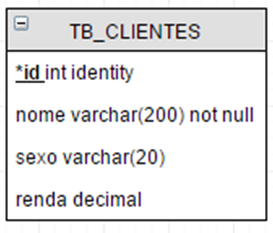
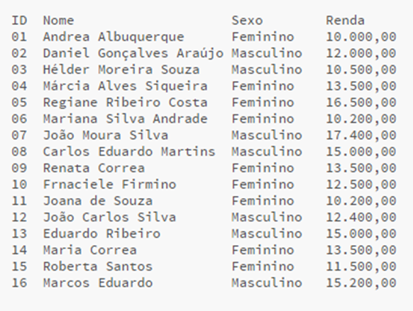
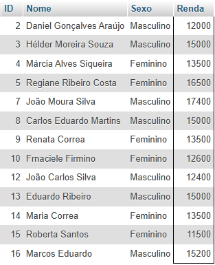

# Resolvendo exercicios `Exercícios-comandos.docx`

1) Crie um banco de dados chamado DB_VENDAS

    ```sql
    CREATE DATABASE db_vendas
    DEFAULT CHARACTER SET utf8
    DEFAULT COLLATE utf8_general_ci;
    ```
2) Coloque em uso esse banco de dados

    ```sql
    USE db_vendas;
    ```

3) Crie a tabela de acordo com o DER/MER e suas entidades e atributos

- TB_CLIENTES
- *id, nome, sexo, renda

    

    ```sql
    CREATE TABLE tb_clientes (
        id int AUTO_INCREMENT,
        nome varchar(200) NOT NULL,
        sexo varchar(20),
        renda decimal,
        PRIMARY KEY(id)
    );
    ```

4) Realize a inserção dos dados abaixo na tabela:

    

    ```sql
    INSERT INTO tb_clientes (nome, renda, sexo) VALUES
    ("Andrea Albuquerque", 10000.00, "Feminino"),
    ("Daniel Gonçalves Araújo", 12000.00, "Masculino"),
    ("Hélder Moreira Souza", 15000.00, "Masculino"),
    ("Márcia Alves Siqueira", 13500.00, "Feminino"),
    ("Regiane Ribeiro Costa", 16500.00, "Feminino"),
    ("Mariana Silva Andrade", 10200.00, "Feminino"),
    ("João Moura Silva", 17400.00, "Masculino"),
    ("Carlos Eduardo Martins", 15000.00, "Masculino"),
    ("Renata Correa", 13500.00, "Feminino"),
    ("Frnaciele Firmino", 12600.00, "Feminino"),
    ("Joana de Souza", 10200.00, "Feminino"),
    ("João Carlos Silva", 12400.00, "Masculino"),
    ("Eduardo Ribeiro", 15000.00, "Masculino"),
    ("Maria Correa", 13500.00, "Feminino"),
    ("Roberta Santos", 11500.00, "Feminino"),
    ("Marcos Eduardo", 15200.00, "Masculino");
    ```

5) Execute um comando para selecionar todos os dados e conferir se estão corretos, caso tenha algum errado, execute uma operação para limpar todos os dados da tabela e inserir todos novamente.

    ```sql
    SELECT * FROM tb_clientes;
    ```

6) De acordo com o nosso MER/DER, TB_CLIENTES é uma ______________

    `Entidade/Tabela`

7) De acordo com o nosso MER/DER, ID, Nome, Sexo, Renda são ______________

    `Colunas da tabela / Tipos de dados`

8) Execute um comando para selecionar apenas ID, Nome e Renda de todos os clientes.

    ```sql
    SELECT id, nome, renda FROM tb_clientes;
    ```

9) Execute um comando para selecionar apenas ID, Nome e Renda de todos os clientes ordenado crescentemente pela Renda.

    ```sql
    SELECT id, nome, renda FROM tb_clientes ORDER BY renda ASC;
    ```

10)	Execute um comando para selecionar apenas ID, Nome e Renda de todos os clientes ordenado decrescentemente pela Renda

    ```sql
    SELECT id, nome, renda FROM tb_clientes ORDER BY renda DESC;
    ```

11)	Execute um comando que selecione todos os dados dos clientes que ganham mais de 12.000 

    ```sql
    SELECT * FROM tb_clientes WHERE renda > 12000;
    ```

12)	Execute um comando que selecione todos os dados dos clientes que ganham mais de 13.000 

    ```sql
    SELECT * FROM tb_clientes WHERE renda > 13000;
    ```
13)	Execute um comando que selecione Nome e Renda dos clientes que ganham igual ou mais de 12.000 ordenado crescentemente pela Renda

    ```sql
    SELECT nome, renda FROM tb_clientes WHERE renda >= 12000 ORDER BY renda ASC;
    ```
14)	A consulta abaixo deve retornar qual ou quais clientes (identificados por ID)?
SELECT ID, Nome, Sexo, Renda FROM Clientes WHERE Renda > 11000



15)	Selecione todos os dados do João

    ```sql
    SELECT * FROM tb_clientes WHERE nome LIKE '%João%';
    ```

16)	Selecione todos os dados da Mariana

    ```sql
    SELECT * FROM tb_clientes WHERE nome LIKE '%Mariana%';
    ```

17)	Selecione apenas o nome e a renda do Carlos

    ```sql
    SELECT nome, renda FROM tb_clientes WHERE nome LIKE '%Carlos%';
    ```
18)	Selecione apenas os clientes do sexo masculino e com a renda maior que 12000

    ```sql
    SELECT * FROM tb_clientes WHERE sexo = "Masculino" AND renda > 12000;
    ```

19)	Selecione apenas os clientes do sexo masculino ou com a renda maior que 12000

    ```sql
    SELECT * FROM tb_clientes WHERE sexo = "Masculino" OR renda > 12000;
    ```

20)	Selecione apenas os clientes com id 7 e id 20

    ```sql
    SELECT * FROM tb_clientes WHERE id IN (7, 20)
    ```

21)	Selecione apenas os clientes com id 7 ou id 20

    ```sql
    SELECT * FROM tb_clientes WHERE id = 7 OR id = 20;
    ```

22)	Selecione apenas os clientes com nome começado em M

    ```sql
    SELECT * FROM tb_clientes WHERE nome like "M%";
    ```

23)	Selecione apenas os clientes com nome começado em C

    ```sql
    SELECT * FROM tb_clientes WHERE nome like "C%";
    ```
24)	Selecione apenas os clientes com que tenham a letra S no nome

    ```sql
    SELECT * FROM tb_clientes WHERE nome like "%C%";
    ```

25)	Selecione apenas os clientes com que tenham a letra U no nome

    ```sql
    SELECT * FROM tb_clientes WHERE nome like "%U%";
    ```

26)	Exiba a média da renda dos clientes que ganham entre 11000 e 13000 

    ```sql
    SELECT AVG(renda) as media_renda FROM tb_clientes WHERE renda >= 11000 and renda <= 13000
    ```

27)	Exiba a média da renda dos clientes ganham entre 11000 e 13000 e que são do sexo feminino

    ```sql
    SELECT AVG(renda) as media_renda FROM tb_clientes WHERE renda >= 11000 and renda <= 13000 and sexo = "Feminino"
    ```

28)	Exiba a média da renda dos clientes que ganham entre 10000 e 12000 e que são do sexo masculino

    ```sql
    SELECT AVG(renda) as media_renda FROM tb_clientes WHERE renda >= 10000 and renda <= 12000 and sexo = "Masculino"
    ```

29)	Apague o registro de todas as mulheres que ganham acima de 15000.

    ```sql
    DELETE FROM tb_clientes WHERE sexo = "Feminino" and renda > 15000;
    ```

30)	Apague o registro de todos os homens que ganham acima de 15000.

    ```sql
    DELETE FROM tb_clientes WHERE sexo = "Masculino" and renda > 15000;
    ```

31)	Apague o registro de todos os homens ou mulheres que ganham acima de 14000.

    ```sql
    DELETE FROM tb_clientes WHERE renda > 14000;
    ```

32)	Apague o registro de todos os homens ou mulheres que ganham entre 10000 e 12000.

    ```sql
    DELETE FROM tb_clientes WHERE renda >= 10000 and renda <= 12000;
    ```

33)	Selecione todas as pessoas que tenham o id entre 3 e 7.

    ```sql
    SELECT * FROM tb_clientes WHERE id IN (3, 7)
    ```

34)	Selecione todos os clientes que ganham entre 11000 e 13000

    ```sql
    SELECT * FROM tb_clientes WHERE renda >= 11000 and renda <= 13000;
    ```

35)	Selecione todos os clientes que ganham entre 11000 e 13000 e que são do sexo feminino

    ```sql
    SELECT * FROM tb_clientes WHERE renda >= 11000 and renda <= 13000 and sexo = "Feminino";
    ```

36)	Selecione todos os clientes que ganham entre 10000 e 12000 e que são do sexo masculino

    ```sql
    SELECT * FROM tb_clientes WHERE renda >= 10000 and renda <= 12000 and sexo = "Masculino";
    ```

37)	Altere a renda de todas as pessoas para 10.000

    ```sql
    UPDATE tb_clientes SET renda = 10000;
    ```

38)	Altere a renda de todas as pessoas do sexo masculino para 9.000

    ```sql
    UPDATE tb_clientes SET renda = 9000 WHERE sexo = "Masculino";
    ```

39)	Altere a renda de todas as pessoas do sexo feminino para 15.000

    ```sql
    UPDATE tb_clientes SET renda = 15000 WHERE sexo = "Feminino";
    ```

40)	Altere a renda de todas as pessoas voltando para o valor original

    ```sql
    UPDATE tb_clientes SET renda = 13500.00 WHERE id = 4;
    UPDATE tb_clientes SET renda = 13500.00 WHERE id = 9;
    UPDATE tb_clientes SET renda = 12600.00 WHERE id = 10;
    UPDATE tb_clientes SET renda = 12400.00 WHERE id = 12;
    UPDATE tb_clientes SET renda = 13500.00 WHERE id = 14;
    ```

41)	Selecione todos as pessoas do sexo masculino e exiba a contagem delas

    ```sql
    SELECT count(*) AS contar_masculino FROM tb_clientes WHERE sexo = "Masculino";
    ```

42)	Selecione todos as pessoas do sexo feminino e exiba a soma da renda de todas.

    ```sql
    SELECT SUM(renda) AS somar_renda FROM tb_clientes WHERE sexo = "Feminino";
    ```

43)	Exiba a quantidade de clientes que ganham entre 11000 e 13000 

    ```sql
    SELECT count(*) AS contar_clientes FROM tb_clientes WHERE renda >= 11000 and renda <= 13000;
    ```

44)	Exiba a soma da renda de todos os clientes que ganham entre 11000 e 13000 e que são do sexo feminino

    ```sql
    SELECT SUM(renda) AS contar_clientes FROM tb_clientes WHERE renda >= 11000 and renda <= 13000 and sexo = "Feminino";
    ```

45)	Exiba a soma da renda de todos os clientes que ganham entre 10000 e 12000 e que são do sexo masculino

    ```sql
    SELECT SUM(renda) AS contar_clientes FROM tb_clientes WHERE renda >= 10000 and renda <= 12000 and sexo = "Masculino";
    ```