# Parte 1: Questões Simples (SELECT, WHERE, LIKE, ORDER BY)

1. Liste o nome completo e o id_aluno de todos os estudantes cadastrados, ordenando pelo nome do aluno.

- Consulta:

```sql
select id_aluno, nome from tb_alunos order by nome asc
```

- Respsota:

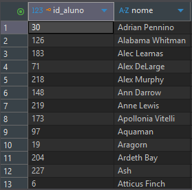

2. Quais são as siglas e os nome_curso de todos os cursos que possuem exatamente 1200 horas de carga_horaria?

- Consulta:

```sql
select sigla, nome_curso from tb_cursos where carga_horaria = 1200
```

- Resposta:

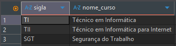

3. Exiba o nome e a especialidade de todos os docentes que são especializados em 'Programação'.

- Consulta:

```sql
select nome, especialidade from tb_docentes where especialidade = 'Programação'
```

- Resposta:

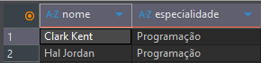

4. Liste o id_sala, numero_sala e capacidade de todas as salas que são do tipo 'TEORICA'.

- Consulta:

```sql
select id_sala, numero_sala, capacidade from tb_salas where tipo = 'Teorica'
```

- Resposta:

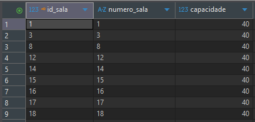

5. Quais são as sigla_turma que ocorrem no turno 'TARDE'?

- Consulta:

```sql
select sigla_turma from tb_turmas where turno = 'TARDE'
```

- Resposta:

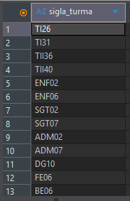

6. Encontre o id_aluno e o nome do aluno cujo ID é 149.

- Consulta:

```sql
select id_aluno, nome from tb_alunos where id_aluno = 149
```

- Resposta:

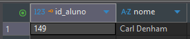

7. Liste o nome_sala e o numero_sala de todas as salas que têm uma capacidade máxima de 30.

- Consulta:

```sql
select nome_sala, numero_sala from tb_salas where capacidade = 30
```

- Resposta:

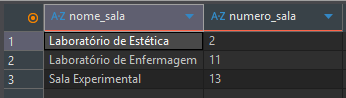

8. Quais cursos (apenas a sigla) têm 1000 horas de carga horária?

- Consulta:

```sql
select sigla from tb_cursos where carga_horaria = 1000
```

- Resposta:

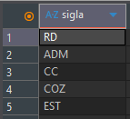

9. Liste o nome dos alunos cujo nome começa com a letra 'W'.

- Consulta:

```sql
select nome from tb_alunos where nome like 'W%'
```

- Resposta:

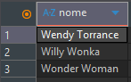

10. Exiba o nome e a especialidade do docente com id_docente igual a 7.

- Consulta:

```sql
select nome, especialidade from tb_docentes where id_docente = 7
```

- Resposta:


11. Liste todas as siglas de turmas que têm o turno 'NOITE' e cujo id_curso_fk é 2 (TII).

- Consulta:

```sql
select sigla_turma from tb_turmas where turno = 'NOITE' and id_curso_fk = 2
```

- Resposta:

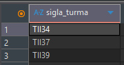

12. Liste o nome de todos os alunos que nasceram exatamente em doze de março de dois mil e cinco.

- Consulta:

```sql
select nome from tb_alunos where data_nascimento = '2005-03-12'
```

- Resposta:

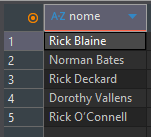

13. Quais turmas (siglas) foram alocadas no Lab de Hardware?

- Consulta:

```sql
select tu.sigla_turma, sa.nome_sala  from tb_turmas tu
inner join tb_salas sa
	on tu.id_sala_fk = sa.id_sala
where sa.nome_sala = 'Laboratório de Hardware'
```

- Resposta:

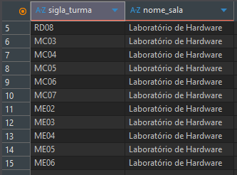

14. Liste o id_curso e o nome_curso de todos os cursos, exceto aqueles com carga_horaria menor ou igual 800 horas.

- Consulta:

```sql
select id_curso, nome_curso from tb_cursos where carga_horaria > 800
```

- Resposta:

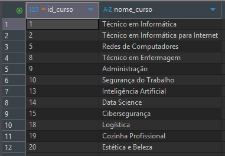

15. Liste os nomes de todos os docentes que não são especializados em 'Enfermagem'.

- Consulta:

```sql
select nome from tb_docentes where especialidade != 'Enfermagem'
```

- Resposta:

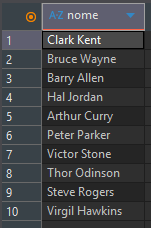

---

# Parte 2: Questões Moderadas (JOINs Simples)

16. Liste o nome e o id_aluno de todos os alunos que estão matriculados na turma com id_turma_fk igual a 17 (ENF01). *(Use tb_alunos e tb_aluno_turma).*

- Consulta:

```sql
select al.nome, al.id_aluno  from tb_aluno_turma at
inner join tb_alunos al
	on al.id_aluno = at.id_aluno_fk
where at.id_turma_fk = 17
```

- Resposta:

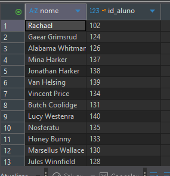

17. Qual é o nome do curso correspondente ao id_curso = 10?

- Consulta:

```sql
select nome_curso from tb_cursos where id_curso = 10
```

- Resposta:

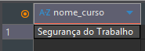

18. Liste o nome dos docentes que estão qualificados para o curso cujo id_curso_fk é 19.

- Consulta:

```sql
select do.nome from tb_docente_curso dc
inner join tb_docentes do
	on do.id_docente = dc.id_docente_fk 
where dc.id_curso_fk = 19
```

- Resposta:

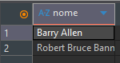

19. Encontre a sigla_turma e o turno de todas as turmas que estão alocadas na sala com id_sala_fk igual a 11 (Laboratório de Enfermagem).

- Consulta:

```sql
select tu.sigla_turma, tu.turno from tb_turmas tu
inner join tb_salas sa
	on sa.id_sala = tu.id_sala_fk
where tu.id_sala_fk = 11
```

- Resposta:

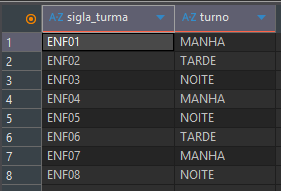

20. Liste a sigla do curso e o nome_curso para todas as turmas cujo id_turma esteja entre 56 e 60. *(Use tb_turmas e tb_cursos).*

- Consulta:

```sql
select cu.sigla, cu.nome_curso from tb_turmas tu
inner join tb_cursos cu
	on cu.id_curso = tu.id_curso_fk
where tu.id_turma >= 56 and tu.id_turma <= 60
```

- Resposta:

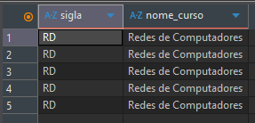

21. Liste a nome_sala de todas as salas que são utilizadas por turmas do turno 'MANHA'.

```sql
select sa.nome_sala, COUNT(sa.id_sala) as total_turma_manha from tb_turmas tu
inner join tb_salas sa
	on sa.id_sala = tu.id_sala_fk
where tu.turno = 'Manhã'
group by sa.nome_sala
```

- Resposta:

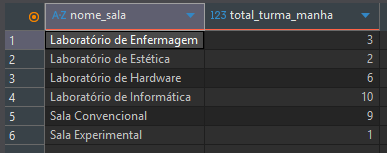

22. Liste o id_docente e o nome dos professores que estão qualificados para o curso de 'Redes de Computadores' (id_curso = 5).

- Consulta:

```sql
select do.id_docente, do.nome from tb_docente_curso dc
inner join tb_docentes do
	on do.id_docente = dc.id_docente_fk
where dc.id_curso_fk = 5
```

- Resposta:

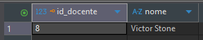

23. Liste o nome dos alunos que estão matriculados na turma de sigla 'SGT04'.

- Consulta:

```sql
select nome from tb_aluno_turma at
inner join tb_alunos al
	on al.id_aluno = at.id_aluno_fk
inner join tb_turmas tu
	on tu.id_turma = at.id_turma_fk
where tu.sigla_turma = 'SGT04'
```

- Resposta:

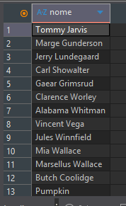

24. Encontre o nome_curso de todas as turmas que estão alocadas na sala 'Laboratório de Hardware'.

- Consulta:

```sql
select cu.nome_curso from tb_cursos cu
inner join tb_turmas tu
	on tu.id_curso_fk = cu.id_curso
inner join tb_salas sa
	on sa.id_sala = tu.id_sala_fk
where sa.nome_sala = 'Laboratório de Hardware'
```

- Resposta:

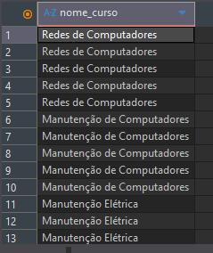


25. Liste o id_aluno_turma e o id_aluno_fk para todas as matrículas no ADM08.

- Consulta:

```sql
select at.id_aluno_turma from tb_aluno_turma at
inner join tb_turmas tu
	on tu.id_turma = at.id_turma_fk
where sigla_turma = 'ADM08'
```

- Resposta:

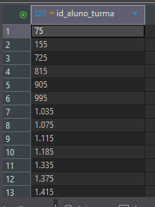

---

# Parte 3: Questões Complexas (Multi-JOINs e Filtros Específicos)

26. Liste o nome do aluno e a sigla_turma para todos os alunos que estão matriculados na turma TI25.

- Consulta:

```sql
select al.nome, tu.sigla_turma from tb_aluno_turma at
inner join tb_turmas tu
	on tu.id_turma = at.id_turma_fk
inner join tb_alunos al
	on al.id_aluno = at.id_aluno_fk 
where sigla_turma = 'TI25'
```

- Resposta:

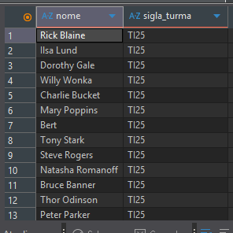

27. Encontre o nome do docente e o nome_curso para as associações onde o docente tem id_docente = 3.

- Consulta:

```sql
select do.nome, cu.nome_curso from tb_docente_curso dc
inner join tb_docentes do
	on do.id_docente = dc.id_docente_fk
inner join tb_cursos cu
	on cu.id_curso = dc.id_curso_fk 
where do.id_docente = 3
```

- Resposta:

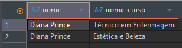

28. Liste a sigla_turma e o nome_sala para as turmas do curso 'Administração' que estão alocadas em salas com capacidade igual a 40.

- Consulta:

```sql
select tu.sigla_turma, sa.nome_sala from tb_turmas tu
inner join tb_salas sa
	on sa.id_sala = tu.id_sala_fk
inner join tb_cursos cu
	on cu.id_curso = tu.id_curso_fk
where cu.nome_curso = 'Administração' and sa.capacidade = 40
```

- Resposta:

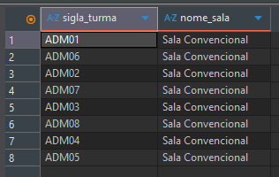

29. Liste o nome de todos os alunos que estão matriculados na turma TI26 **OU** na turma TI30.

- Consulta:

```sql
select nome from tb_aluno_turma at
inner join tb_alunos al
	on al.id_aluno = at.id_aluno_fk
inner join tb_turmas tu
	on tu.id_turma = at.id_turma_fk
where tu.sigla_turma = 'TI26' or tu.sigla_turma = 'TI30'
```

- Resposta:

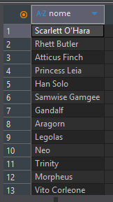

30. Liste os nomes de todas as salas que são do tipo 'LABORATORIO' **E** que possuem uma capacidade menor que 35.

- Consulta:

```sql
select nome_sala from tb_salas
where tipo = 'LABORATORIO' and capacidade < 35
```

- Resposta:

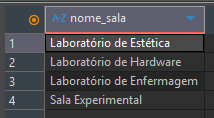

31. Liste o nome_curso de todos os cursos para os quais a docente 'Diana Prince' está qualificado.

- Consulta:

```sql
select cu.nome_curso from tb_docente_curso dc
inner join tb_cursos cu
	on cu.id_curso = dc.id_curso_fk
inner join tb_docentes do
	on do.id_docente = dc.id_docente_fk
where do.nome = 'Diana Prince'
```

- Resposta:

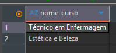

32. Qual é a sigla_turma e o nome_curso de todas as turmas que utilizam a sala 'Laboratório de Enfermagem'?

- Consulta:

```sql
select tu.sigla_turma, cu.nome_curso from tb_cursos cu
inner join tb_turmas tu
	on tu.id_curso_fk = cu.id_curso
inner join tb_salas sa
	on tu.id_sala_fk = sa.id_sala
where sa.nome_sala = 'Laboratório de Enfermagem'
```

- Resposta:

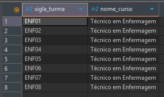

33. Liste o nome dos alunos que estão matriculados na turma 'TI29'.

- Consulta:

```sql
select al.nome from tb_aluno_turma at
inner join tb_alunos al
	on al.id_aluno = at.id_aluno_fk 
inner join tb_turmas tu
	on tu.id_turma = at.id_turma_fk
where tu.sigla_turma = 'TI29'
```

- Resposta:

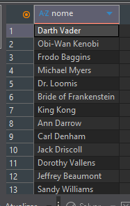

34. Liste o nome do docente e a sigla do curso para as qualificações do docente com id_docente_fk = 5.

- Consulta:

```sql
select do.nome, cu.sigla from tb_docente_curso dc
inner join tb_cursos cu
	on cu.id_curso = dc.id_curso_fk
inner join tb_docentes do
	on do.id_docente = dc.id_docente_fk
where dc.id_docente_fk = 5
```

- Resposta:

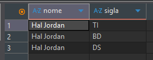

35. Liste a sigla_turma e o nome_curso para as turmas que pertencem aos cursos TI (id_curso = 1) **OU** TII.

- Consulta:

```sql
select tu.sigla_turma, cu.nome_curso from tb_cursos cu
inner join tb_turmas tu
	on tu.id_curso_fk = cu.id_curso
where cu.id_curso = 1 or cu.sigla = 'TII'
```

- Resposta:

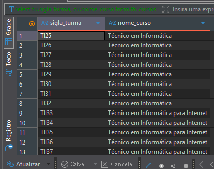

36. Liste o nome_curso de todos os cursos, excluindo 'Técnico em Informática' (id_curso = 1).

- Consulta:

```sql
select nome_curso from tb_cursos
where id_curso != 1
```

- Resposta:

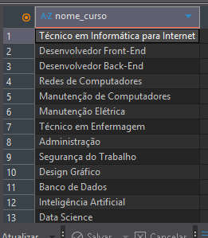

37. Encontre o nome_sala e a sigla_turma para as turmas do turno 'NOITE' que estão alocadas em salas de tipo 'TEORICA'.

- Consulta:

```sql
select sa.nome_sala, tu.sigla_turma from tb_turmas tu
inner join tb_salas sa
	on sa.id_sala = tu.id_sala_fk
where tu.turno = 'NOITE' and sa.tipo = 'TEORICA'
```

- Resposta:

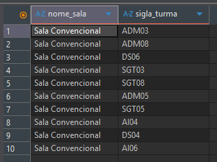

38. Liste o nome do aluno e o id_turma_fk para as matrículas com id_aluno_fk igual a 40 (The Narrator).

- Consulta:

```sql
select al.nome, tu.id_turma_fk from tb_aluno_turma tu
inner join tb_alunos al
	on al.id_aluno = tu.id_aluno_fk
where tu.id_aluno_fk = 40
```

- Resposta:

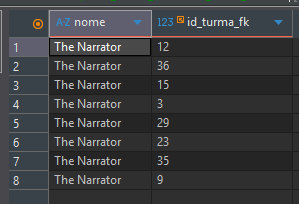

39. Liste a sigla_turma e o nome_curso para as turmas cujo curso tenha a carga_horaria de 800 horas.

- Consulta:

```sql
select tu.sigla_turma, cu.nome_curso from tb_turmas tu
inner join tb_cursos cu
	on cu.id_curso = tu.id_curso_fk
where cu.carga_horaria = 800
```

- Resposta:

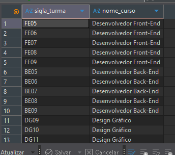

40. Encontre o nome e a especialidade do docente que tem o id_docente 11.

- Consulta:

```sql
select nome, especialidade from tb_docentes
where id_docente = 11
```

- Respotas:

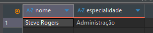

41. Liste a sigla_turma e o nome_curso para as turmas cujo turno é 'MANHA'. *(Use tb_turmas e tb_cursos).*

- Consulta:

```sql
select tu.sigla_turma, cu.nome_curso from tb_turmas tu
inner join tb_cursos cu
	on cu.id_curso = tu.id_curso_fk
where tu.turno = 'MANHA'
```

- Resposta:

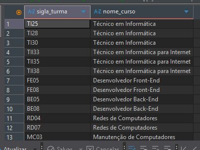

42. Liste o nome_sala e o numero_sala para salas com capacidade diferente de 40.

- Consulta:

```sql
select nome_sala, numero_sala from tb_salas
where capacidade != 40
```

- Resposta:

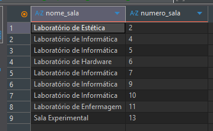

43. Liste o nome dos alunos que estão matriculados nas turmas que utilizam a sala de id_sala = 7. *(Use tb_alunos, tb_aluno_turma, tb_turmas).*

- Consulta:

```sql
select al.nome from tb_aluno_turma at
inner join tb_alunos al
	on al.id_aluno = at.id_aluno_fk
inner join tb_turmas tu
	on tu.id_turma = at.id_aluno_turma
where tu.id_sala_fk = 7
```

- Resposta:

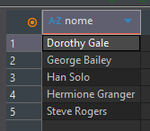

44. Liste o nome_curso e a carga_horaria para cursos com carga_horaria maior que 1000 horas.

- Consulta:

```sql
select nome_curso, carga_horaria from tb_cursos
where carga_horaria > 1000
```

- Resposta:

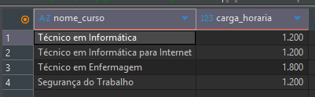

45. Encontre a sigla_turma e o turno para as turmas cujo id_curso_fk é 8 (Enfermagem) e que estão alocadas na id_sala_fk 11.

- Consulta:

```sql
select sigla_turma, turno from tb_turmas
where id_curso_fk = 8 and id_sala_fk = 11
```

- Resposta:

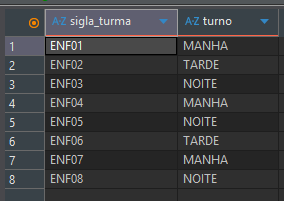

46. Liste o nome dos docentes que são especializados em 'Administração'.

- Consulta:

```sql
select nome from tb_docentes
where especialidade = 'Administração'
```

- Resposta:

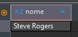

47. Liste o id_aluno, nome e data_nascimento para os alunos com id_aluno maior que 230.

- Consulta:

```sql
select id_aluno, nome, data_nascimento from tb_alunos
where id_aluno > 230
```
- Resposta:

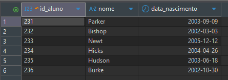