# Parte 2:

1.	Conte quantos alunos nasceram em cada ano diferente, listando o ano e o total de alunos, e ordene o resultado pelo ano mais antigo para o mais recente.

- Consulta:

```sql
select
	year(data_nascimento) as ano,
	count(id_aluno) as total_de_alunos
from tb_alunos
group by year(data_nascimento)
order by ano desc 
```

Resposta:

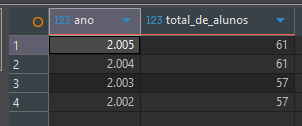

2.	Liste o nome do curso e a quantidade total de turmas abertas para cada curso, mas inclua apenas os cursos que possuem mais de cinco turmas.

- Consulta:

```sql
select 
    c.nome_curso,
    sum(t.data_fim > current_date()) as total_turmas_abertas
from tb_cursos c
join tb_turmas t
    on c.id_curso = t.id_curso_fk
group by 
    c.nome_curso
having 
    count(t.id_turma) > 5
```

- Resposta:

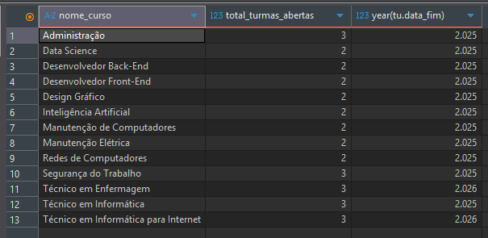

3.	Para cada turno (MANHA, TARDE, NOITE), calcule a média da carga horária dos cursos que são oferecidos nesse turno.

- Consulta

```sql
select
	tu.turno,
	round(avg(cu.carga_horaria), 2) as media_carga_horaria
from tb_turmas tu
inner join tb_cursos cu
	on cu.id_curso = tu.id_curso_fk 
group by tu.turno 
```

- Resposta:

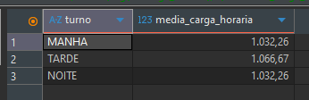

4.	Liste o nome do docente e quantos cursos diferentes ele está qualificado a ministrar, mas mostre apenas os docentes qualificados para três ou mais cursos.

- Consulta:

```sql
select 
    do.nome,
    count(dc.id_curso_fk) as cursos_diferentes
from tb_docente_curso dc
inner join tb_docentes do
    on do.id_docente = dc.id_docente_fk
group by do.id_docente, do.nome
having cursos_diferentes >= 3
```

- Resposta:

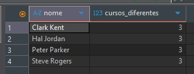

5.	Encontre a sigla da turma e o número total de alunos matriculados em cada turma, ordenando pela turma com mais alunos primeiro.

- Consulta:

```sql
select
    tu.sigla_turma,
    count(at.id_aluno_fk) as total_alunos
from tb_aluno_turma at
inner join tb_turmas tu
	on tu.id_turma = at.id_turma_fk 
group by tu.sigla_turma
order by total_alunos desc
```

- Resposta:

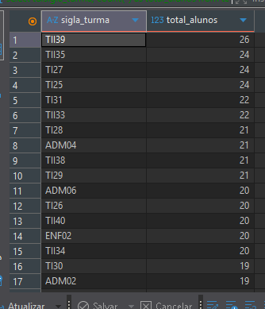

6.	Quais salas (nome da sala) têm uma média de capacidade usada (considerando apenas a capacidade da sala) que é inferior a 38?

- Consulta:

```sql
select
	sa.numero_sala as sala,
	round(avg(t.total_alunos), 2) as media_usada
from (
	select
		count(id_aluno_fk) as total_alunos,
		id_turma_fk 
	from tb_aluno_turma
	group by id_turma_fk 
) as t
inner join tb_turmas tu
	on tu.id_turma = t.id_turma_fk
inner join tb_salas sa
	on sa.id_sala = tu.id_sala_fk 
group by sa.id_sala, sa.numero_sala 
having media_usada < 38
```

- Resposta:

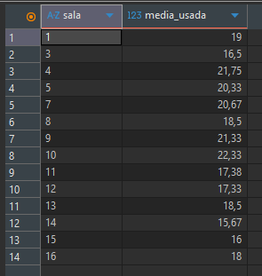

7.	Liste o nome do curso e a carga horária máxima entre todos os cursos que possuem turmas abertas.

- Consulta:

```sql
select
	cu.nome_curso,
	cu.carga_horaria
from tb_cursos as cu
inner join tb_turmas tu
	on tu.id_curso_fk = cu.id_curso 
where tu.data_fim > CURRENT_DATE() or tu.data_fim is null
order by cu.carga_horaria desc
limit 1
```

- Resposta:

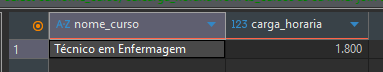

8.	Quais são os cursos (sigla) que possuem exatamente 150 alunos matriculados no total?

- Consulta:

```sql
select
	cu.sigla,
	count(at.id_aluno_fk) as total_alunos
from tb_cursos cu
inner join tb_turmas tu
	on tu.id_curso_fk = cu.id_curso
inner join tb_aluno_turma at
	on at.id_turma_fk = tu.id_turma
group by cu.id_curso
having total_alunos = 150
```

- Resposta:

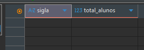

9.	Encontre o nome do aluno e quantas turmas diferentes ele está matriculado, listando apenas os alunos que estão matriculados em quatro turmas ou mais.

- Consulta:

```sql
select
	al.nome,
	count(at.id_turma_fk) as numero_turmas
from tb_alunos al
inner join tb_aluno_turma at
	on at.id_aluno_fk = al.id_aluno
group by al.id_aluno
having numero_turmas >= 4
order by al.nome
```

- Resposta:

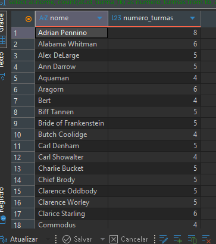

10.	Liste a especialidade do docente e a quantidade de docentes que possuem essa especialidade, exibindo apenas as especialidades que têm apenas um docente associado.

- Consulta:

```sql
select
	especialidade,
	count(id_docente) as docentes
from tb_docentes
group by especialidade
having docentes = 1
order by especialidade asc
```

- Resposta:

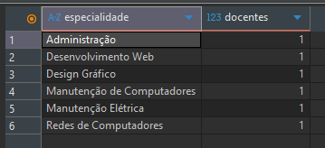

11.	Encontre a sala (nome e tipo) que é usada por turmas do turno 'MANHA' e possui a maior capacidade.

- Consulta:

```sql
select
	sa.nome_sala,
	sa.tipo
from tb_salas sa
inner join tb_turmas tu
	on tu.id_sala_fk = sa.id_sala
where turno = "MANHA"
order by sa.capacidade desc
limit 1
```

- Resposta:

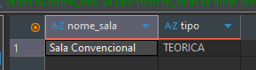

12.	Liste a data de nascimento e o número de alunos que nasceram nessa data, focando apenas nas datas em que nasceram pelo menos 3 alunos.

- Consulta:

```sql
select
	data_nascimento,
	count(id_aluno ) as nasceram
from tb_alunos
group by data_nascimento
having nasceram >= 3
```

- Resposta:

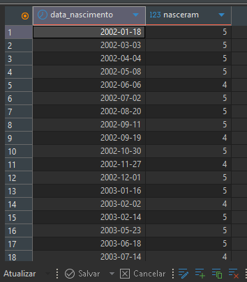

13.	Calcule o total de carga horária oferecida para cada sigla de curso.

- Consulta:

```sql
select
	sigla,
	sum(carga_horaria)
from tb_cursos
group by sigla
order by sigla
```
- Resposta:

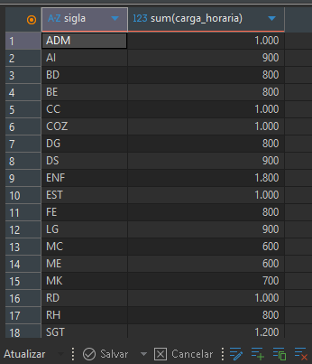

14.	Liste o ID da sala e o número total de turmas alocadas nela, mas ignore as salas que abrigam menos de 5 turmas.

- Consulta:

```sql
select
	sa.id_sala,
	count(tu.id_turma ) as total_turmas
from tb_salas sa
inner join tb_turmas tu
	on tu.id_sala_fk = sa.id_sala
group by sa.id_sala
having total_turmas >= 5
order by sa.id_sala 
```

- Resposta:

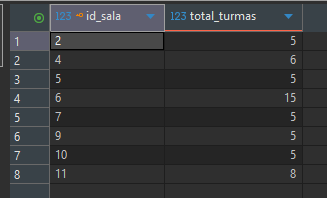

15.	Qual é o ID da turma que possui o menor número de alunos matriculados?

- Consulta:

```sql
select
	id_turma_fk as id_turma_menos_alunos
from tb_aluno_turma
group by id_turma_fk
order by count(id_aluno_fk) asc
limit 1
```

- Resposta

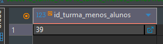

16.	Liste o nome do curso e a quantidade de turmas do turno 'TARDE' associadas a ele.

- Consulta:

```sql
select 
	cu.nome_curso,
	count(tu.id_turma) as quantidade_turmas
from tb_cursos cu
inner join tb_turmas tu
	on tu.id_curso_fk = cu.id_curso
where tu.turno = "TARDE"
group by cu.id_curso
order by cu.nome_curso
```

- Resposta:

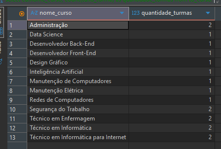

17.	Encontre o nome do docente e o nome do curso que ele é qualificado, mas apenas se o curso tiver uma carga_horaria de exatamente 800 horas.

- Consulta:

```sql
select
	do.nome,
	cu.nome_curso
from tb_docentes do
inner join tb_docente_curso dc
	on dc.id_docente_fk = do.id_docente
inner join tb_cursos cu
	on cu.id_curso = dc.id_curso_fk
where cu.carga_horaria = 800
order by do.nome 
```

- Resposta:

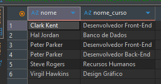

18.	Liste o nome do curso e o número de turmas que iniciaram em '2024-02-01'.
19.	Quais são as turmas (sigla) que têm o nome do aluno matriculado começando com a letra 'A' (LIKE 'A%') e possuem mais de 3 alunos cujo nome se encaixa nesse critério?
20.	Liste o nome do aluno e quantos cursos diferentes ele está estudando atualmente (baseado nas turmas em que está matriculado).
21.	Para cada tipo de sala (TEORICA ou LABORATORIO), mostre a capacidade total combinada (SUM(capacidade)).
22.	Liste o nome do curso e quantos alunos no total estão matriculados em turmas pertencentes a esse curso, focando apenas nos cursos que têm mais de 80 alunos matriculados.
23.	Encontre o ID da turma e a data de início para todas as turmas que possuem exatamente 15 matrículas.
24.	Liste o nome da sala e a quantidade de turmas alocadas nela, mas apenas para salas do tipo 'LABORATORIO'.
25.	Quais são os docentes (nome) que estão qualificados para cursos cuja carga horária total somada seja superior a 2500 horas?
26.	Liste a sigla da turma e a carga horária do curso correspondente, para todas as turmas do turno 'TARDE'.
27.	Encontre o nome do aluno e a média da carga horária dos cursos em que ele está matriculado.
28.	Liste o nome do curso e o número de alunos que nasceram no mês de dezembro e estão matriculados em alguma turma desse curso.
29.	Qual é o nome do curso que tem turmas alocadas na sala 'Sala Convencional' (nome_sala = 'Sala Convencional') e a carga horária média dessas turmas é igual a 1000 horas?